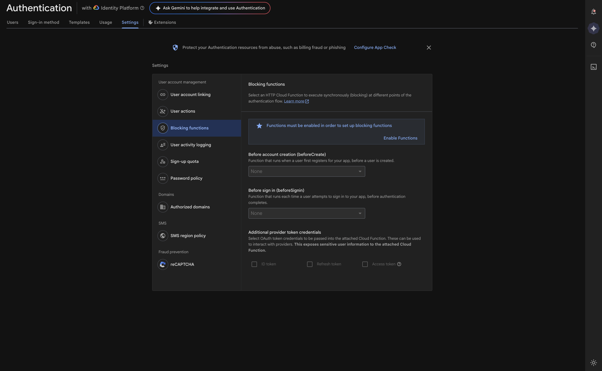
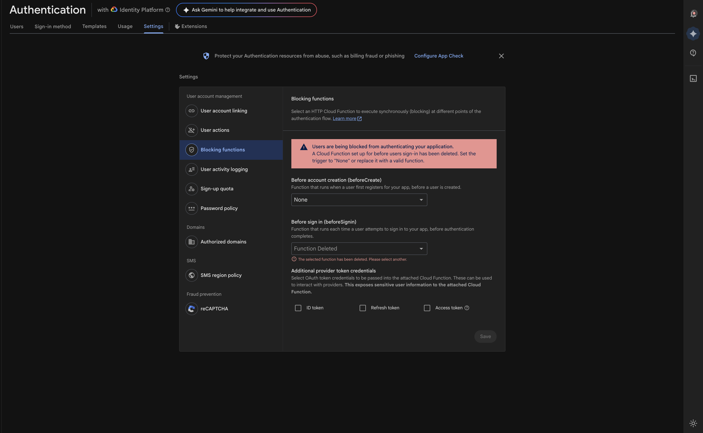
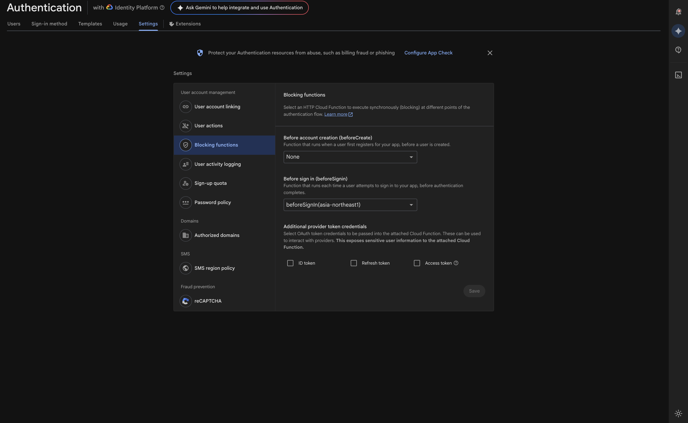

# Repro for issue 9997

## Versions

firebase-tools: v15.8.0

## Pre-requisite

1. Blaze plan project
2. GCIP for Firebase Authentication
   

## Steps to reproduce

1. Install dependencies
   - Run `cd functions`
   - Run `npm i`
   - Run `cd ../`
2. Run `firebase deploy --only functions:beforeSignIn,hosting --project PROJECT_ID`
   - Deployment does not raise errors
3. Go to auth console auth blocking function section
   - An error is displayed
     
4. Go to deployed hosting site, and click the `Sign In` button https://PROJECT_ID.web.app
   - Error is thrown

```
Error signing in: auth/error-code:-47 Firebase: Error (auth/error-code:-47).
```

5. Go to Cloud Run console https://console.cloud.google.com/run/detail/asia-northeast1/beforesignin/observability/logs?authuser=0&hl=en-US&project=PROJECT_ID
   - Error is raised in logs

```
FirebaseAuthError: Firebase Auth Blocking token has incorrect "aud" (audience) claim. Expected "run.app" but got "https://asia-northeast1-PROJECT_ID.cloudfunctions.net/beforeSignIn"
```

## Notes

Performing any update on the `beforeUserSignedIn` function will automatically and correctly update the `Before sign in` function in auth console


